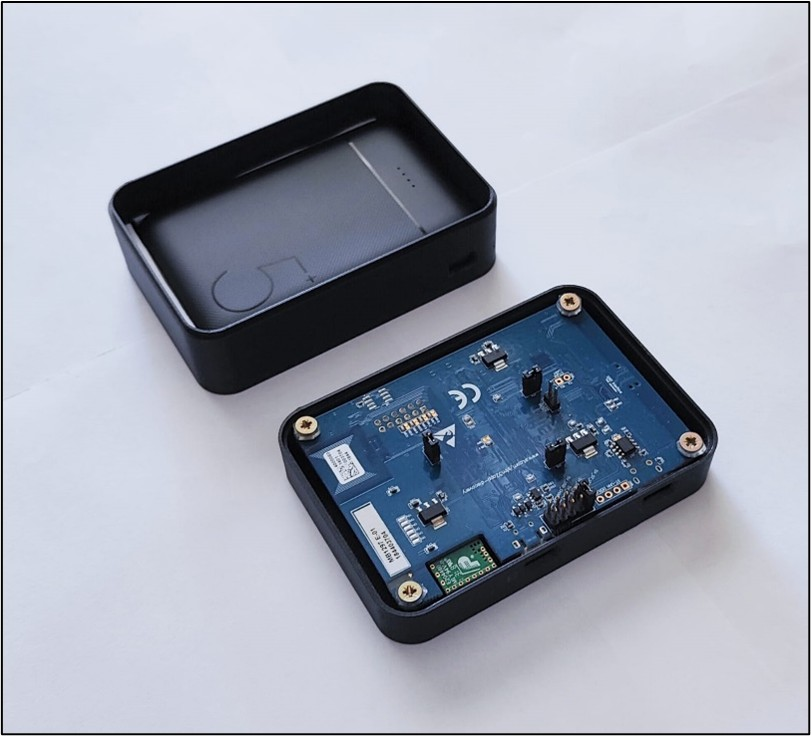
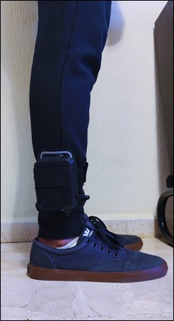
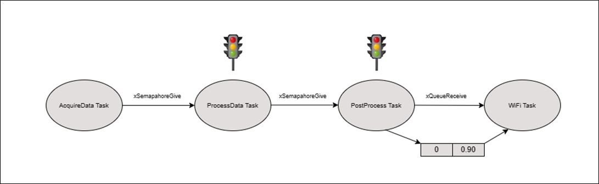
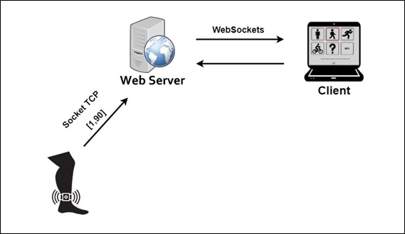
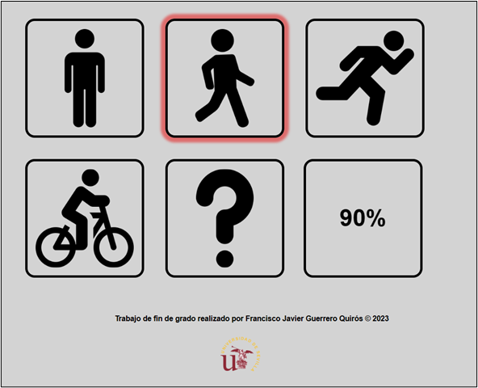

# TFG
Embedded neural network for human activity recognition.

It includes:
- Application code in different versions.
- Python scripts for network training and file formatting.
- The dataset is located in the data folder.
- Model trained and stored in .h5 and .tflite format.
- Web server project with all dependencies.
- The STM VAL folder includes the input and output files to perform model validation on the device, as the input format is slightly different from python.

Warnings:
- Have version 7.0 of the X-CUBE-AI framework installed.
- In case of training your own model, have Tensorflow version 2.5.0 or lower.
- This model is trained with a series of data in movement, with the sensors located in an area near the ankle, if it is not used in this way the results may be not correct.
- To run the server we go to the project path and type the command “node index.js”.
- For the web application, make sure that both the device and the server are within the same network.
- The sensors used to train the model is the ultra low power IMU LSM6DSL through the I2C interface.

Workflow and results obtained:

## Data acquisition

To collect our own set of data. It is necessary to secure and protect the device. To address this issue a case has been developed on a 3d printer.

## Working on real time

In this section, the architecture of the firmware is described using FreeRTOS and having a less priority task of displaying the results on a web server.

